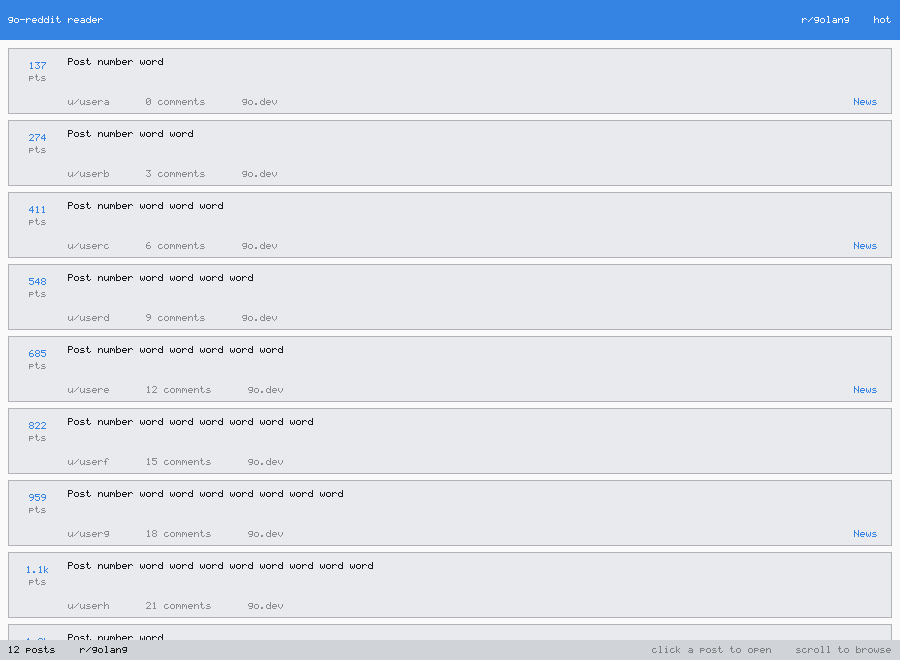

# go-reddit/reader

A native **macOS** Reddit reader whose entire UI is drawn by
[go-widgets](https://github.com/go-widgets/toolkit) — compiled to WebAssembly,
blitted into a `<canvas>`, and hosted in a **WKWebView** that is opened from Go
with **zero cgo** (`CGO_ENABLED=0`).

<p align="center"></p>

## What it is

```
┌─ "Reddit Reader.app"  (pure Go, CGO=0, self-contained) ───────────────┐
│                                                                        │
│   internal/ui        go-widgets toolkit renders the feed → RGBA buffer │
│   cmd/front  (wasm)  blits that buffer into a browser <canvas>         │
│   internal/server    serves the wasm + proxies /api → Reddit           │
│   internal/webview   opens a WKWebView via purego (no cgo)             │
│                                                                        │
│   Transport (default): a WKURLSchemeHandler serves every request       │
│   in-process — no TCP, no unix socket, no listening port at all.       │
│                                                                        │
│        fetch  reader://app/api/feed ──► go-reddit/reddit ──► reddit.com │
└────────────────────────────────────────────────────────────────────────┘
```

Three design choices worth calling out:

1. **go-widgets, not HTML.** The post list, score badges, wrapped titles and
   status bar are all painted pixel-by-pixel by the go-widgets toolkit, exactly
   as they would be in a native window — the WebView is just a surface.
2. **CGO=0 everywhere.** The WKWebView, NSWindow and NSApplication are driven
   through the Objective-C runtime via
   [purego](https://github.com/ebitengine/purego). The shipped binary links
   only system libraries; AppKit/WebKit are `dlopen`ed at runtime.
3. **No socket.** Instead of a loopback HTTP server, the default transport
   registers a private `reader://` URL scheme and answers every request
   in-process from the same `http.Handler`. Nothing on the machine can reach
   the app's content, and no port is consumed. (A unix socket wouldn't help
   here — WKWebView can't dial one; the scheme handler is strictly better.)
   Pass `-http` to fall back to a `127.0.0.1` server (used off macOS and for
   automated testing).

## Try it

```sh
# No Reddit credentials needed — serves a built-in sample feed:
task run          # == go run . -demo

# Build a double-clickable app bundle:
task app          # produces dist/Reddit Reader.app
open "dist/Reddit Reader.app" --args -demo
```

Against real Reddit:

```sh
task build
./dist/reader -sr golang -sort top
# OAuth (recommended — anonymous .json is often blocked with a 403):
READER_OAUTH_CLIENT_ID=…  READER_OAUTH_CLIENT_SECRET=…  ./dist/reader
```

### Flags & environment

| Flag | Env | Meaning |
|------|-----|---------|
| `-sr` | `READER_SUBREDDIT` | subreddit (empty = front page) |
| `-sort` | `READER_SORT` | `hot`/`new`/`top`/`rising`/`controversial`/`best` |
| `-demo` | | serve a built-in sample feed, no network |
| `-http` | | use a loopback TCP server instead of the URL-scheme transport |
| `-no-window` | | open the default browser instead of a native window |
| `-serve-only` | | run headless over TCP and print the URL |
| | `READER_OAUTH_CLIENT_ID` / `_SECRET` | app-only OAuth |
| | `READER_OAUTH_USERNAME` / `_PASSWORD` | script-grant OAuth |

## Build layout

- `internal/ui` — the go-widgets scene: layout, hit-testing, rendering. Pure,
  native-testable (100% coverage), no build tag.
- `cmd/front` — the `GOOS=js GOARCH=wasm` entry point (syscall/js glue).
- `internal/server` — static bundle + `/api` proxy (100% coverage).
- `internal/webview` — the purego WKWebView + `WKURLSchemeHandler` bridge.

The wasm bundle is a build artifact; `scripts/build-wasm.sh` (run by every
`task` target) produces `internal/server/assets/reader.wasm`.

## Testing notes

Everything that can run without a display is covered by native tests: the UI
scene renders to a byte buffer checked pixel-for-non-blank (and dumped to PNG
when `READER_PNG` is set), the server is driven through `httptest`, and the
Objective-C bridge is exercised against the **real** runtime (NSString round
trips, NSData, class registration, and the scheme-handler request/response path
via a mock `WKURLSchemeTask`). The window creation and Cocoa run loop
(`webview.Run`) are a native-integration boundary verified by launching the
built app; they are the only substantial code the unit tests can't reach on a
headless machine.

## License

BSD-3-Clause — see [LICENSE](LICENSE). Copyright the go-reddit/reader authors.
